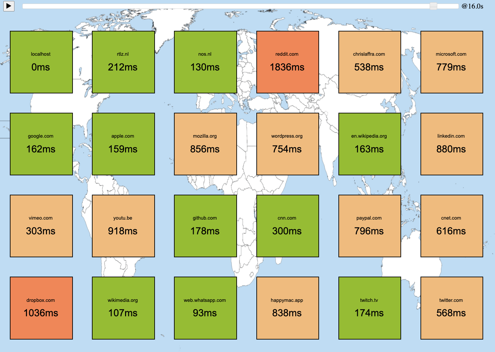

# What is Feynman?
Feynman is a visualization library to explain a complex Python project in simple terms

|  by showing surprising things happening in the system. 

## An Example - Visualizing Database Access

Consider the database defined in [test/db.py](test/db.py):

``` python
class Database(object):
    def __init__(self, name):
        self.name = name
        self.data = {}

    def read(self, key):
        # reading is fast
        time.sleep(0.001)
        return self.data.get(key, None)

    def write(self, key, value):
        # writing is slow
        time.sleep(0.01)
        self.data[key] = value

    def delete(self, key):
        time.sleep(0.005)
        del self.data[key]
```

This simplified API offers a simple key-value store to read and write values based on a key. 

Here is an example that reads and writes 100 objects between two databases we call `book1` and `book2`:

``` python
def main():
    log("step 1. Create two books")
    book1 = open("book1")
    book2 = open("book2")
    count = 100
    keys = [f"key-{n}" for n in range(count)]
    values = [f"value-{n}" for n in range(count)]

    log("step 2. Write values to book 1")
    for key, value in zip(keys, values):
        book1.write(key, value)

    log("step 3. Copy values from book 1 to 2")
    for key in keys:
        value = book1.read(key)
        book2.write(key, value)

    log("step 4. Read values from book 2")
    for n in range(3):
        for key in keys:
            value = book2.read(key)

    log("step 5. Clear book 1")
    for key in keys:
        book1.delete(key)

    log("step 6. Done")
```
    
</details>


This example runs for a while, simulating the cost of DB accesses, and produces this output:
```
% python3 test/db.py
step 1. Create two books
step 2. Write values to book 1
step 3. Copy values from book 1 to 2
step 4. Read values from book 2
step 5. Clear book 1
step 6. Done
```

Now, consider the following declarative script in [explain.py](explain.py).
First, we introduce a few helper functions and import `feynman`:
``` python
from collections import defaultdict
import feynman;
import time

databases = {}
colors = [ "pink", "lightyellow", "lightgreen", "lightblue", "white" ]
counts = defaultdict(int)

def get_x(name):
    if not name in databases:
        databases[name] = len(databases)
    index = databases[name]
    return 100 + index * 303

def get_color(name):
    return colors[ get_x(name) % len(colors) ]

def increment_count(name, operation):
    key = f"{name}-{operation}"
    counts[key] += 1
    return counts[key]

def database(x, y, w, h, name, background="white", font="12px Arial"):
    feynman.rectangle(x, y + h/10, w, 6*h/10, background=background)
    feynman.oval(x, y, w, h/5, background=background)
    feynman.oval(x, y + 3*h/5, w, h/5, background=background)
    feynman.rectangle(x + 2, y + 6*h/10, w, h/10, border="", background=background)
    feynman.text(x, y + 3*h/8, name, w, 24, "center", font)
```

Then we declare two visual elements that are rendered as part of the startup:
``` python

feynman.text(100, 100, "Reading and writing data between two databases", 900, font="32px Arial")
feynman.text(100, 170, "", 900, font="24px Arial", color="blue", id="step")
```

The second text we add above has an id called `step`. Below, we show how that id is used 
to update the text whenever the orginal code calls `log`.

Next, we declare a couple of declarative rules. These are functions that have the 
same shape as target functions in our original code. The decorator serves to tell
`feynman` that whenever `db.Database.__init__` is called, the `createDatabase` function
shown here should be called with the exact same arguments.

``` python
@feynman.on("db.Database.__init__")
def createDatabase(self, name):
    database(get_x(name), 250, 90, 170, name, get_color(name), "24px Courier")
    feynman.text(get_x(name) + 100, 290, "read: 0", id=f"{name}-read")
    feynman.text(get_x(name) + 100, 310, "write: 0", id=f"{name}-write")
    feynman.text(get_x(name) + 100, 330, "size: 0", id=f"{name}-size")
```

We also define declarative visualization rules for `read`, `write`, and `delete`, so
that we can show some statistices for each of the two databases we are visualizing:

``` python
@feynman.on("db.Database.read")
def read(self, key):
    feynman.update(f"{self.name}-read", "text", f"read: {increment_count(self.name, 'read')}")

@feynman.on("db.Database.write")
def write(self, key, value):
    feynman.update(f"{self.name}-write", "text", f"write: {increment_count(self.name, 'write')}")
    feynman.update(f"{self.name}-size", "text", f"size: {len(self.data)}")

@feynman.on("db.Database.delete")
def delete(self, key):
    feynman.update(f"{self.name}-size", "text", f"size: {len(self.data)}")
```

The final rule is for `log`, as we mentioned above. It updates the title bar of our visualization
to show the (blue) message to track progress in our program: 

``` python
@feynman.on("db.log")
def log(message):
    feynman.update("step", "text", message)
```

To finish up the visualization script, we create a Feynman context and run `db.main`:

``` python
print("running test/db.py with Feynman.Explain...")
when = time.time()
with feynman.Explain():
    import db
    db.main()
    print("Ran for", time.time() - when, "seconds")
```

The `db` module runs the same as before, but `explain.py` now draws the program state, while `test/db.py` is running, in an easy to understand diagram:


## An Example - Creating a Metrics Dashboard

The code in [test/ping.py](test/ping.py) checks the health of a number of websites from around the world. It also tries to guess 
what location the server is based in. It then generates a table
with metrics, resembling this:

```
Locations:
--------------------------------------------------------------------------------
localhost            0.0s  Netherlands
rtlz.nl              0.2s  Netherlands
nos.nl               0.1s  United States
reddit.com           1.8s  United States
chrislaffra.com      0.5s  United States
microsoft.com        0.8s  United States
google.com           0.2s  United States
apple.com            0.2s  United States
mozilla.org          0.9s  United States
wordpress.org        0.8s  United States
en.wikipedia.org     0.2s  Netherlands
linkedin.com         0.9s  United States
vimeo.com            0.3s  United States
youtu.be             0.9s  United States
github.com           0.2s  United States
cnn.com              0.3s  United States
paypal.com           0.8s  United States
cnet.com             0.6s  United States
dropbox.com          1.0s  United States
wikimedia.org        0.1s  Netherlands
web.whatsapp.com     0.1s  Ireland
happymac.app         0.8s  United States
twitch.tv            0.2s  United States
twitter.com          0.6s  United States
--------------------------------------------------------------------------------
```

Of course, localhost connections are really fast. Some sites take
a lot longer than others. However, from the table it is not easy to detect the anomalies in a quick scan. 

However, the metrics can easily be converted to color ranges and shown in a dashboard style, as shown in [test/explain-ping.py](test/explain-ping.py). The outliers stick out immediately:




## Earlier work
Feynman is inspired by a number of similar projects developed by [Chris Laffra](https://chrislaffra.com). Here are some examples
- [Hotwire](https://www.usenix.org/conference/usenix-6th-c-technical-conference/presentation/hotwire-visual-debugger-c), the closest to project Feynman, to visualize C++ and Smalltalk programs, 1993
- [XRay](https://www.slideshare.net/chrislaffra/eclipse-visualization-and-performance-monitoring), hardwired visualization for Java programs, such as Eclipse, 2003
- [QzAcademy](https://www.slideshare.net/chrislaffra/livecode-python-training-tools-at-bank-of-america), a time travel debugger for the Quartz project, written in Python, 2008
- [PyAlgoViz](https://pyalgoviz.appspot.com), visualization of about 50 algorithms, using a DSL to visualize the internal state at each line of the Python scripts, 2010
- [Cacophonia](https://www.slideshare.net/chrislaffra/project-cacophonia), graph-based visualization of Eclipse, as a Java program, 2021
- [Pynsights](https://github.com/laffra/pynsights), graph visualization of Python modules, 2021
